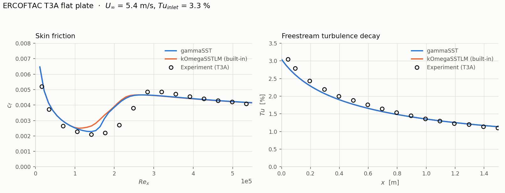
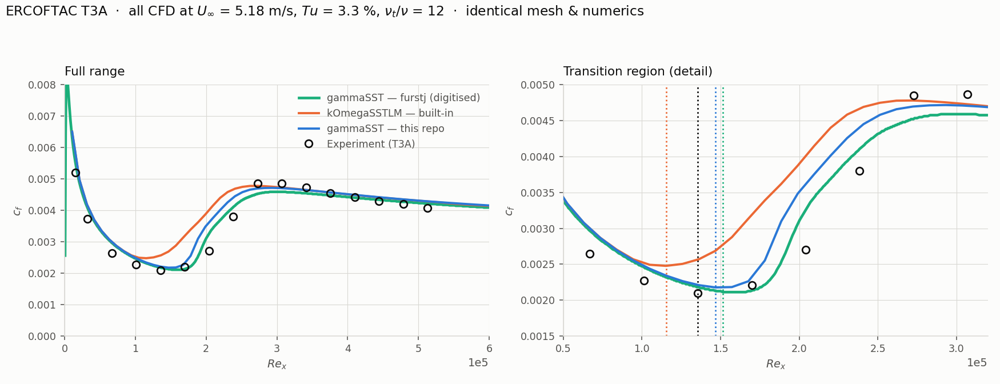
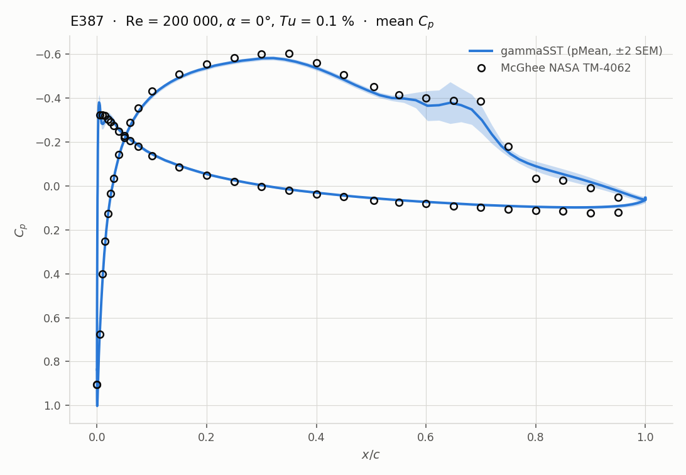

# gammaSST for OpenFOAM 13

A **from-scratch implementation of the original Menter et al. (2015) one-equation
local correlation-based transition model** (the "γ model", coupled to k-ω SST) for
**OpenFOAM 13** (Foundation / openfoam.org line).

Builds **out of tree** into `$FOAM_USER_LIBBIN`. **No file in `$FOAM_SRC` or
`$FOAM_TUTORIALS` is modified, patched, or recompiled.** You load it at run time with
a single `libs` entry.

Works for **both incompressible and compressible** solvers from one shared
implementation — the regime is selected automatically by whichever solver you run.

---

## Table of contents

- [1. What this model is](#1-what-this-model-is)
- [2. Why the "original Menter" and not a variant](#2-why-the-original-menter-and-not-a-variant)
- [3. Model equations as implemented](#3-model-equations-as-implemented)
- [4. Requirements](#4-requirements)
- [5. Install](#5-install)
- [6. Using it in your own case](#6-using-it-in-your-own-case)
- [7. Validation](#7-validation)
- [8. Model coefficients](#8-model-coefficients)
- [9. Repository layout](#9-repository-layout)
- [10. How this was built — implementation guide](#10-how-this-was-built--implementation-guide)
- [11. Troubleshooting](#11-troubleshooting)
- [12. References](#12-references)
- [13. License](#13-license)

---

## 1. What this model is

`gammaSST` is a **three-equation** transition/turbulence model: the two standard
k-ω SST equations plus **one** transport equation for the intermittency `γ`
(`gammaInt`).

It predicts laminar→turbulent transition (natural, bypass, separation-induced)
using only **local** variables — no integral boundary-layer thickness, no
non-local search, so it is fully parallel-safe and unstructured-mesh-safe.

**Contrast with OpenFOAM's built-in `kOmegaSSTLM`:** that is the *older*
Langtry–Menter **four**-equation γ–Reθt model, which additionally transports
`ReThetat`. Menter's 2015 γ model replaces that fourth transport equation with an
**algebraic** critical-momentum-thickness-Reynolds-number correlation `Reθc`, and
adds an explicit pressure-gradient function `F_PG`.

| | `kOmegaSSTLM` (built in) | `gammaSST` (this repo) |
|---|---|---|
| Author / year | Langtry & Menter, 2009 | Menter, Smirnov, Liu & Avancha, 2015 |
| Transport equations | 4 (`k`, `omega`, `gammaInt`, `ReThetat`) | 3 (`k`, `omega`, `gammaInt`) |
| `Reθc` | from transported `ReThetat` | algebraic correlation of `TuL`, `F_PG` |
| Galilean invariant | no (uses freestream `U`) | **yes** |
| Pressure-gradient term | via `Reθt` correlation | explicit `F_PG` function |
| Cost | higher | ~1 equation cheaper, more robust |

The 2015 model is Galilean invariant because it never references a freestream
velocity magnitude — a practical advantage for moving/rotating frames, and one
reason it is now the ANSYS default transition model.

---

## 2. Why the "original Menter" and not a variant

This repo implements the paper **exactly as published**, with the published
coefficient values as defaults. Nothing is retuned, and no extra terms are added.

Other public implementations (e.g. `furstj/gammaSST`, `dul6/transition-models`)
target the **ESI/openfoam.com** line (`v2012`…`v2412`), which has a different
turbulence-model framework (`TurbulenceModels`/`turbulenceProperties`) than
OpenFOAM 13's (`MomentumTransportModels`/`momentumTransport`). They will **not**
compile against OF13 unmodified. This repo is written directly against the OF13
API.

Every coefficient is exposed in `gammaSSTCoeffs` and defaults to the paper value,
so you can reproduce the original **or** retune it for your own work without
touching source.

---

## 3. Model equations as implemented

**Intermittency transport**

$$\frac{\partial(\rho\gamma)}{\partial t}+\frac{\partial(\rho u_j\gamma)}{\partial x_j}
= P_\gamma - E_\gamma + \frac{\partial}{\partial x_j}\left[\left(\mu+\frac{\mu_t}{\sigma_\gamma}\right)\frac{\partial\gamma}{\partial x_j}\right]$$

$$P_\gamma = F_{length}\,\rho\,S\,\gamma(1-\gamma)\,F_{onset},\qquad
E_\gamma = c_{a2}\,\rho\,\Omega\,\gamma\,F_{turb}\,(c_{e2}\gamma-1)$$

**Transition onset**

$$Re_V=\frac{\rho d^2 S}{\mu},\qquad R_T=\frac{\rho k}{\mu\omega}$$

$$F_{onset,1}=\frac{Re_V}{2.2\,Re_{\theta c}},\qquad
F_{onset,2}=\min(F_{onset,1},2),\qquad
F_{onset,3}=\max\!\left(1-\left(\tfrac{R_T}{3.5}\right)^3,0\right)$$

$$F_{onset}=\max(F_{onset,2}-F_{onset,3},0),\qquad
F_{turb}=e^{-(R_T/2)^4}$$

**Algebraic `Reθc` correlation** (this is what replaces the 4th equation)

$$Re_{\theta c}=C_{TU1}+C_{TU2}\,\exp\!\left(-C_{TU3}\,Tu_L\,F_{PG}\right)$$

$$Tu_L=\min\!\left(100\frac{\sqrt{2k/3}}{\omega d},\,100\right),\qquad
\lambda_{\theta L}=-7.57\times10^{-3}\,\frac{dV}{dy}\frac{d^2}{\nu}+0.0128$$

$$F_{PG}=\begin{cases}
\min(1+C_{PG1}\lambda_{\theta L},\;C_{PG1lim}) & \lambda_{\theta L}\ge 0\\[4pt]
\min\!\left(1+C_{PG2}\lambda_{\theta L}+C_{PG3}\min(\lambda_{\theta L}+0.0681,0),\;C_{PG2lim}\right) & \lambda_{\theta L}<0
\end{cases}$$

with $\lambda_{\theta L}$ clipped to $[-1,1]$ and $F_{PG}\ge 0$.

**Coupling to SST** — production and destruction of `k` are modified, plus a
separation-induced correction, and `F1` is blended so the transition region stays
in k-ω mode:

$$P_k \rightarrow \gamma P_k + P_k^{lim},\qquad
D_k \rightarrow \min(\max(\gamma,0.1),1)\,D_k$$

$$P_k^{lim}=5\,C_k\max(\gamma-0.2,0)(1-\gamma)\,F_{on}^{lim}\max(3C_{SEP}\mu-\mu_t,0)\,S\,\Omega$$

$$F_{on}^{lim}=\min\!\left(\max\!\left(\frac{Re_V}{2.2\,Re_{\theta c}^{lim}}-1,\,0\right),3\right),\qquad
F_1 \rightarrow \max(F_1^{SST},F_3),\quad F_3=e^{-(R_y/120)^8}$$

---

## 4. Requirements

- **OpenFOAM 13** (openfoam.org / Foundation line) — [openfoam.org/version/13](https://openfoam.org/version/13/)
- A working `wmake` toolchain (ships with OpenFOAM)
- `gnuplot` (optional — only for the validation plots)

> **Not compatible with** openfoam.com (ESI) `vXXXX` releases, or Foundation
> versions ≤ 12, without changes. See [the implementation guide](doc/IMPLEMENTATION-GUIDE.md#porting-to-other-openfoam-versions)
> for what would have to change.

---

## 5. Install

```bash
cd $FOAM_RUN
cd ..
git clone https://github.com/zulfikarMahmud/gammaSST-of13.git
cd gammaSST-of13
```

Source your OpenFOAM 13 environment, then build:

```bash
source /opt/openfoam13/etc/bashrc
chmod +x ./Allwmake
./Allwmake
```

This produces `$FOAM_USER_LIBBIN/libgammaSST.so`. Verify:

```bash
ls -la $FOAM_USER_LIBBIN/libgammaSST.so
```

To clean:

```bash
chmod +x ./Allwclean
./Allwclean
```

**Nothing is installed into the OpenFOAM tree** — the library lives entirely under
your user directory (`~/OpenFOAM/<user>-13/platforms/.../lib`), so an OpenFOAM
upgrade or reinstall cannot be broken by it, and removing it is just deleting the
`.so`.

---

## 6. Using it in your own case

Three edits, all in your case directory.

**(a) `system/controlDict` — load the library**

```cpp
libs            ("libgammaSST.so");
```

**(b) `constant/momentumTransport` — select the model**

```cpp
simulationType RAS;

RAS
{
    model           gammaSST;
    turbulence      on;
}
```

**(c) `0/gammaInt` — add the intermittency field**

Dimensionless, `1` in the freestream, `zeroGradient` at walls:

```cpp
dimensions      [];
internalField   uniform 1;

boundaryField
{
    inlet   { type fixedValue; value $internalField; }
    outlet  { type zeroGradient; }
    walls   { type zeroGradient; }
}
```

You need `0/k`, `0/omega`, `0/nut` exactly as for `kOmegaSST`. You do **not** need
`0/ReThetat` — that is the 4-equation model's field and is unused here.

> **Migrating from `kOmegaSSTLM`?** Change the model name, delete `0/ReThetat`,
> add the `libs` line. Everything else carries over.

### Compressible or incompressible — automatic

The same library serves both. Run an incompressible solver
(`foamRun -solver incompressibleFluid`) and the incompressible instantiation is
constructed; run a compressible one (`foamRun -solver fluid`) and the compressible
one is. **You do not set a flag.** See [the implementation guide](doc/IMPLEMENTATION-GUIDE.md#step-7--register-for-both-regimes)
for why this works.

---

## 7. Validation

### 7.1 ERCOFTAC T3A — flat-plate bypass transition

The classic flat-plate bypass-transition benchmark (`Tu = 3.3 %` at inlet,
`U∞ = 5.4 m/s`, `ν = 1.5e-5 m²/s`, zero pressure gradient).

```bash
source /opt/openfoam13/etc/bashrc
cd tutorials/T3A
./Allrun
```

This runs `blockMesh` → `foamRun` (1000 SIMPLE iterations, ~27k cells) and writes
`validation/graphs.eps`: skin friction `c_f` vs `Re_x`, and turbulence intensity
decay vs `x`, both against the Savill/ERCOFTAC experimental data in
`validation/exptData/T3A.dat`.

The case is a copy of OpenFOAM 13's own `incompressibleFluid/T3A` tutorial with
only three changes (model name, `libs` line, `0/ReThetat` removed), so it is a
**direct like-for-like comparison against the built-in `kOmegaSSTLM`**: same mesh,
same BCs, same numerics.



| Metric | **gammaSST** (this repo) | `kOmegaSSTLM` (built-in) | Experiment |
|---|---|---|---|
| Transition onset `Re_x` | **1.42e5** (ratio 1.01) | 1.09e5 (ratio 0.77) | 1.41e5 |
| `c_f` mean abs. error | **0.00034** (11.2 %) | 0.00039 (13.7 %) | — |
| `Tu` decay mean abs. error | 0.096 % | 0.095 % | — |
| Transport equations | **3** | 4 | — |
| SIMPLE iterations | **251** | 268 | — |

Transition onset lands within **1 %** of the measured `c_f` minimum, against ~23 %
early for the built-in 4-equation model — the improvement the 2015 model was
introduced to deliver. Intermittency stays in bounds (`0.020 ≤ γ ≤ 1.001`).

For numbers instead of a picture:

```bash
cd tutorials/T3A/validation && python3 compare.py
```

#### Cross-validation against the reference implementation

Independently checked against **[furstj/gammaSST](https://github.com/furstj/gammaSST)**
(Jiří Fürst's ESI-line implementation, the de-facto reference), on both code and
results.

**Coefficients** — all 15 defaults identical: `Flength` 100, `ca2` 0.06, `ce2` 50,
`sigmaGamma` 1, `CTU1/2/3` 100/1000/1, `CPG1` 14.68, `CPG1lim` 1.5, `CPG2` −7.34,
`CPG3` 0, `CPG2lim` 3, `ReThetacLim` 1100, `Ck` 1, `CSEP` 1.

**Formulation** — `ReThetac`, `Fonset`, `Fturb`, `TuL`, `FPG` (including the
`λ_θL` expression and its sign branch) are term-for-term equivalent, as is the
γ-equation implicit/explicit split.

**Results** — his repository publishes figures only, so his `c_f` curve was
recovered with [`digitise_furstj.py`](tutorials/T3A/validation/reference/digitise_furstj.py).
The extraction is self-calibrating: his figure also plots the experimental points,
and his `exptData/T3A.dat` is byte-identical to OpenFOAM 13's, so the script
predicts where all 16 markers must land and checks them — **mean 0.44 px, max
0.82 px** (1 px = 761 in `Re_x`, 1.4e-05 in `c_f`).

To eliminate `U∞` as a variable, this model **and** the built-in `kOmegaSSTLM`
were re-run at his exact `U∞ = 5.18 m/s`. The coarse mesh was verified
**identical vertex-for-vertex** between the two repositories.



Transition onset, all at `U∞ = 5.18 m/s` on his **medium** mesh (107 280 cells):

| | onset `Re_x` | vs furstj |
|---|---|---|
| **this repo, gammaSST** | 1.467e5 | −3.2 % |
| furstj, gammaSST | 1.515e5 | — |
| built-in `kOmegaSSTLM` | 1.153e5 | −23.9 % |
| experiment | 1.355e5 | — |

In the fully-turbulent region the two γ implementations agree to **0.2 %**
(`c_f` at `Re_x` = 5e5: 0.00424 vs 0.00423), and pointwise across the whole
curve to 5 %.

**On the remaining onset difference — and a caveat that matters.** Onset is
strongly grid-sensitive for this model: refining moves it monotonically toward
his value.

| mesh | cells | onset `Re_x` | vs furstj |
|---|---|---|---|
| coarse | 26 820 | 1.363e5 | −10.1 % |
| medium | 107 280 | 1.467e5 | −3.2 % |

His README does not state which mesh produced the published figure. The gap
closes from 10 % to 3 % with one refinement and was **still moving**, so treat
this as agreement within grid sensitivity rather than a converged match — and
quote no onset number from this model without saying which mesh it came from.
The coarse mesh happening to sit nearest the experiment (1.363e5 vs 1.355e5) is
most likely favourable cancellation, not accuracy.

The claims that do **not** depend on mesh — identical coefficients, term-for-term
identical formulation, 0.2 % agreement in the turbulent region — are what
establish that this port reproduces the reference model.

> **One deliberate difference:** furstj's version also carries a **crossflow**
> extension (`FonsetCF`, `CRSF`) from later work. This repo implements the 2015
> paper as published, so that term is absent by design.

See [`tutorials/T3A/README.md`](tutorials/T3A/README.md) for full discussion.

---

### 7.2 Eppler 387, Re = 200 000 — laminar separation bubble

The case the model is actually for: separation-induced transition at **low**
freestream turbulence (`Tu = 0.1 %`), validated against McGhee, Walker & Millard,
NASA TM-4062.

```bash
cd tutorials/E387-Re200k && ./Allrun
```



| region | mean \|ΔCp\| |
|---|---|
| **overall** | **0.0198** |
| upper (suction) | 0.0240 |
| lower (pressure) | 0.0156 |

Suction peak CFD −0.581 @ `x/c` 0.322 vs experiment −0.601 @ `x/c` 0.350; the
bubble plateau and reattachment recovery are both captured.

This run **does not converge to steady state, and should not** — the bubble is
physically unsteady and the solver limit-cycles (`Cl` swings ~16 % peak-to-peak).
The comparison therefore uses the **mean over the limit cycle**, formed in post
from the written surface samples, with a ±2 SEM band drawn so the sampling
uncertainty is visible rather than hidden. See
[`tutorials/E387-Re200k/README.md`](tutorials/E387-Re200k/README.md).

---

## 8. Model coefficients

All optional; all default to the published Menter et al. (2015) values. Override
in `constant/momentumTransport`:

```cpp
RAS
{
    model           gammaSST;
    turbulence      on;

    gammaSSTCoeffs
    {
        Flength     100;
        ca2         0.06;
        ce2         50;
        sigmaGamma  1;
        CTU1        100;
        CTU2        1000;
        CTU3        1;
        CPG1        14.68;
        CPG1lim     1.5;
        CPG2        -7.34;
        CPG3        0;
        CPG2lim     3;
        ReThetacLim 1100;
        Ck          1;
        CSEP        1;
    }
}
```

| Coefficient | Default | Role |
|---|---|---|
| `Flength` | 100 | transition-length / γ production magnitude |
| `ca2`, `ce2` | 0.06, 50 | γ destruction (relaminarisation) |
| `sigmaGamma` | 1 | γ diffusion Prandtl number |
| `CTU1`, `CTU2`, `CTU3` | 100, 1000, 1 | `Reθc(TuL, F_PG)` correlation |
| `CPG1`, `CPG1lim` | 14.68, 1.5 | favourable pressure gradient |
| `CPG2`, `CPG3`, `CPG2lim` | −7.34, 0, 3 | adverse pressure gradient |
| `ReThetacLim` | 1100 | separation-induced `Pk` limiter onset |
| `Ck`, `CSEP` | 1, 1 | separation-induced `Pk` limiter strength |

Inherited k-ω SST coefficients (`alphaK1`, `betaStar`, `a1`, …) are also
accepted here and keep their standard SST defaults.

---

## 9. Repository layout

```
gammaSST-of13/
├── Allwmake                     # build -> $FOAM_USER_LIBBIN/libgammaSST.so
├── Allwclean                    # clean
├── LICENSE                      # GPL-3.0 (same as OpenFOAM)
├── README.md
├── doc/
│   └── IMPLEMENTATION-GUIDE.md  # step-by-step: build this yourself from nothing
├── gammaSST/
│   ├── Make/
│   │   ├── files                # sources to compile + output library name
│   │   └── options              # include paths + link libraries
│   ├── gammaSST.H               # class declaration
│   ├── gammaSST.C               # model implementation
│   ├── gammaSSTIncompressibleMomentumTransportModels.C   # registration
│   └── gammaSSTCompressibleMomentumTransportModels.C     # registration
└── tutorials/
    ├── T3A/                     # ERCOFTAC T3A -- flat-plate bypass transition
        ├── 0/ constant/ system/ # case setup
        ├── Allrun / Allclean
        └── validation/
            ├── compare.py       # quantitative metrics vs experiment
            ├── plot.py          # c_f + Tu decay figure
            ├── plot_compare.py  # four-way: ours / furstj / built-in / experiment
            ├── createGraphs     # gnuplot equivalent (OpenFOAM-idiomatic)
            ├── exptData/        # Savill / ERCOFTAC T3A data
    │       └── reference/
    │           ├── digitise_furstj.py   # recover his published curve + calibrate
    │           └── furstj_T3A_cf.csv    # the recovered numbers
    └── E387-Re200k/             # Eppler 387 -- laminar separation bubble
        ├── 0/ constant/ system/ # case setup (mesh supplied, gzipped)
        ├── Allrun / Allclean
        ├── validate_cp.py       # forms pMean in post, compares vs McGhee
        └── validation/
            ├── exptData/        # McGhee NASA TM-4062 Cp
            └── cp_validation.png
```

---

## 10. How this was built — implementation guide

**→ [`doc/IMPLEMENTATION-GUIDE.md`](doc/IMPLEMENTATION-GUIDE.md)** is a complete,
from-nothing walkthrough: architecture, build files, header, implementation,
dual-regime registration, case setup, validation, and a debugging checklist.

The short version — the decisions that matter:

1. **Inherit, don't copy.** `gammaSST` is k-ω SST plus one equation and three
   modified terms, and OpenFOAM 13 exposes exactly those terms as `virtual`
   hooks (`Pk`, `epsilonByk`, `F1`). Overriding them gives ~480 lines instead of
   ~1500, and upstream SST fixes propagate for free.
2. **`LIB = $(FOAM_USER_LIBBIN)/libgammaSST`** in `Make/files` is what keeps the
   build out of the OpenFOAM installation.
3. **Solve γ before the base solves k**, since `Pk()` reads it.
4. **Two registration units, one template** — that is the whole mechanism behind
   automatic compressible/incompressible selection.
5. **Validate against data, not against "it converged."** The first working
   build of this model converged cleanly to a completely unphysical state
   (γ ≈ 6300). The guide documents that bug and the two checks that catch it.

## 11. Troubleshooting

**`Unknown RASModel type gammaSST`**
The library wasn't loaded. Check `libs ("libgammaSST.so");` is in
`system/controlDict`, and that `$FOAM_USER_LIBBIN/libgammaSST.so` exists.

**`cannot open shared object file: libgammaSST.so`**
`$FOAM_USER_LIBBIN` isn't on the library path — you almost certainly forgot to
`source /opt/openfoam13/etc/bashrc` in this shell.

**`Cannot find file "gammaInt"`**
Add `0/gammaInt` as shown in [§6](#6-using-it-in-your-own-case).

**Floating point exception on startup**
Usually a cold start with `nut = 0` everywhere and a uniform field. Check your
`0/omega` is nonzero, and that inlet `k` is not exactly `0`.

**Undefined symbol at link time mentioning `physicalProperties`**
`-lphysicalProperties` missing from `Make/options` `LIB_LIBS`.

---

## 12. References

- **MENTER, F. R., SMIRNOV, P. E., LIU, T. & AVANCHA, R. (2015).** A one-equation
  local correlation-based transition model. *Flow, Turbulence and Combustion*
  **95**(4), 583–619. [doi:10.1007/s10494-015-9622-4](https://doi.org/10.1007/s10494-015-9622-4)
  — **the model implemented here.**
- **MENTER, F. R., LANGTRY, R. & VÖLKER, S. (2006).** Transition modelling for
  general purpose CFD codes. *Flow, Turbulence and Combustion* **77**, 277–303.
- **LANGTRY, R. B. & MENTER, F. R. (2009).** Correlation-based transition modeling
  for unstructured parallelized CFD codes. *AIAA Journal* **47**(12), 2894–2906.
  — the 4-equation predecessor (`kOmegaSSTLM`).
- **SAVILL, A. M. (1993).** Some recent progress in the turbulence modelling of
  by-pass transition. *Near-wall turbulent flows*, 829–848. — T3A data.
- [ERCOFTAC Classic Collection, T3A test case](http://cfd.mace.manchester.ac.uk/ercoftac/)
- Prior art on the ESI line: [furstj/gammaSST](https://github.com/furstj/gammaSST),
  [dul6/transition-models](https://github.com/dul6/transition-models)

---

## 13. License

GPL-3.0, matching OpenFOAM. See [LICENSE](LICENSE).

This offering is not approved or endorsed by the OpenFOAM Foundation, the
producer of the OpenFOAM software and owner of the OPENFOAM® and OpenCFD®
trademarks.

This implementation was done through ClaudeCode and closely monitoring the implementation. Please contact at zulfikarmahmudjoy@gmail.com for any query. 
